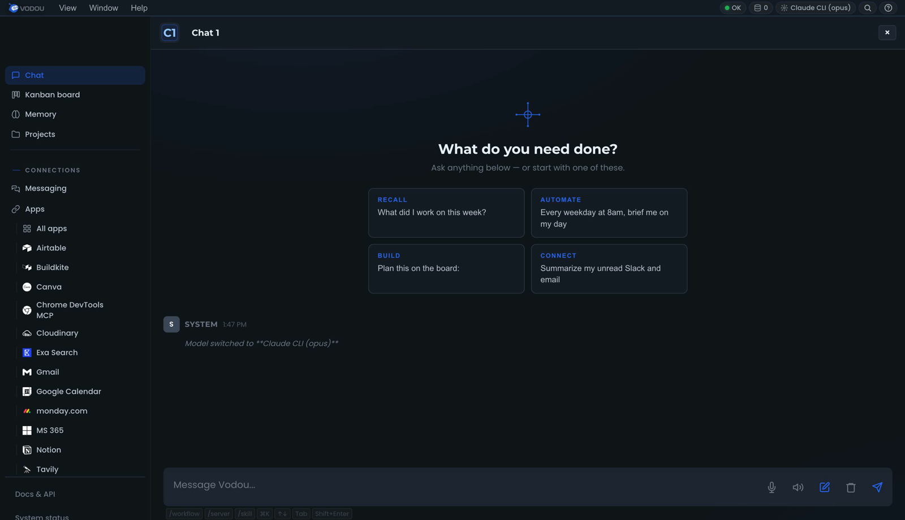
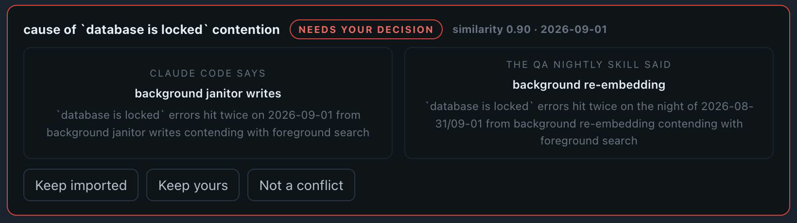

<!-- Destination: VodouAI/OS → README.md.
     Rewritten 2026-09-02 per PLANS/0.6.30/PLAN-README-FRONT-DOOR.md (v2: end-user first).
     PUBLISH GATE (P7): do not publish until the public quickstart has one green run on a
     machine that is not Chad's. Written and staged ahead of that on purpose. -->

# Vodou

**Vodou is an app that runs on your computer and gives every AI you use one memory of you —
your facts, your preferences, your files, your tools and your rules — then shows you exactly
what it did with them.**

> Everyone else builds a harness for the agents you run. Vodou carries yours to the AI you
> actually use.



<!-- DEMO GIF: PLAN-README-FRONT-DOOR P5 — the ChatGPT moment, recorded through the guided
     walkthrough on a fresh Chrome profile. Goes here, above the console still, when it
     exists. The still above is a real screenshot of a live console (v0.6.27), uncropped
     except for the bottom dock. -->

## What you can do with it

- **Ask ChatGPT "what's my dog's name?" and it knows.** Press Ctrl+B in ChatGPT, Claude,
  Gemini, Perplexity, Grok, Copilot or 16 other sites and your memory arrives in *their*
  composer. Nothing to copy-paste, nothing to re-explain.
- **Use Claude Code, Cursor and Gemini CLI and have them all know the same things.** Your
  memory and rules reach every coding agent through the files they already read. Switch tools
  without your AI getting dumber.
- **Drop in a PDF, a contract, a spec, a folder — then ask which document answers a question.**
  It reads them, remembers them, and cites the one that matters.
- **Text it from your phone and it actually does the thing.** Telegram, Slack, WhatsApp,
  iMessage, Discord, email, voice — same brain, same tools, whichever surface you're on.
- **Say what you want and see the plan before it runs.** "Research three competitors and put
  the summary in a doc" becomes visible steps you can run once, edit, save as a reusable
  skill, or schedule. If it needs a decision from you mid-run, it stops and asks.
- **Connect the apps you already use.** Notion, Linear, Gmail, Slack, Microsoft 365, Stripe,
  Figma, Cloudflare and more, callable from any chat.
- **Keep work and personal apart.** Vaults and per-project scoping decide what an AI can see;
  a leak policy you control decides what may never leave.
- **Use your own AI keys — or no key at all.** OpenAI, Anthropic, Google, Groq, Mistral,
  DeepSeek, xAI, OpenRouter… or a local model: llama.cpp ships with Vodou, Ollama and LM
  Studio are one setting away. Cheap local models can do the housekeeping while a frontier
  model handles the hard question.
- **See a receipt for every turn** — `4 memories · 2 tools · 1 skill` — and a queue of the
  places two memories disagree, for you to settle instead of the AI guessing.

## How it works, in three lines

1. **It captures.** The chats you're already having, the documents you add, the facts you
   pin — extracted into a memory that lives in a database **on your machine**.
2. **It follows you.** A browser extension for the AI sites, hooks and rules files for the
   coding agents, an MCP host for desktop apps, chat channels for your phone.
3. **It shows its work.** Every turn leaves a receipt. Every surface is graded on evidence —
   a check with no evidence answers **`unknown`, never `ok`**.

## Three things nothing else does

**It goes *into* the AI you already use.** Not a chat window of ours next to theirs. The
extension works on **22 sites** today; the same memory reaches Claude Code, Cursor, Gemini
CLI, Codex, Zed and the other coding agents through hooks and the rules files they already read.

**Any AI client can adopt your brain.** Vodou is an **MCP host**, not just another server —
Claude Desktop, Cursor, VS Code, Windsurf, Zed or a script can attach in one command, each
with its own identity, a scoped profile, an audit log and a kill switch. Anything that speaks
OpenAI can use Vodou as its backend and get your context for free.

<details>
<summary>Attach a client / the OpenAI-compatible endpoint</summary>

```bash
vodou-core mcp install            # which clients are detected
vodou-core mcp install cursor     # write Cursor's entry — done
```

`POST http://127.0.0.1:8765/v1/chat/completions` — see
[docs/mcp-host.md](docs/mcp-host.md) and [docs/openai-compatible-api.md](docs/openai-compatible-api.md).
</details>

**It never tells you it worked when it cannot prove it did.** Receipts per turn, a conflict
queue instead of silent averaging, and a self-grader that reports what it has *evidence* of
per surface. Every one of these exists because we shipped the opposite once and wrote it
down — the [engineering blog](https://blog.vodou.ai) is where those stories are told.



<details>
<summary>What the self-grader prints (<code>vodou-core hosts</code>)</summary>

<!-- Generated from `vodou-core hosts` on 2026-09-02 13:50 local (engine 0.6.27, registry
     schema v2). Regenerate in the release playbook step that writes the CHANGELOG entry;
     do not hand-edit. Rows are graded from gateway.db, not from the registry's own claims —
     a host declared `unsupported` that turns out to have turns renders CONTRADICTED and the
     command exits 2 (PLAN-HOST-REGISTRY-FALSIFIABLE, landed 2026-09-02). -->
```
host            transport   status   prompt  rec_turn  recall  evid
chatgpt-web     extension   stable     ✓        ✓        ✓      ✓
claude-ai-web   extension   stable     ✓        ✓        ✓      ✓
claude-code     hook        stable     ✓        ✓        —      ✓
cursor          hook        stable     ✓        ✓        —      ✓
gemini-cli      hook        stable     ✓        ✓        —      ✓
telegram        gateway     stable     ✓        ✓        —      ✓
vodou-console   gateway     stable     ✓        ✓        —      ✓
```
*`✓` = evidence in the database · `—` = none found in the window · rows shown are the ones a
first-day user meets. Yes, the `recall` column is honest: for hook and gateway hosts it is still
graded from a rotating log rather than a row of its own, so it goes blank between windows. That
is a gap in our instrument, it is listed as one, and this table will change when it is fixed.*
</details>

## Quickstart (~10 minutes)

**macOS (Apple Silicon or Intel) · Linux (x64 or arm64):**
```bash
curl -fsSL https://raw.githubusercontent.com/VodouAI/OS/main/install-vodou.sh | bash
```

**Windows (x64, beta):**
```powershell
irm https://raw.githubusercontent.com/VodouAI/OS/main/install-vodou.ps1 | iex
```

Here is exactly what happens next — nothing in this list is a placeholder:

1. **The installer** clones this open tree, downloads the matching engine binary from
   [`VodouAI/vodou-core`](https://github.com/VodouAI/vodou-core/releases), **verifies its
   SHA-256** against the release manifest (and refuses to run on a mismatch), provisions the
   runtime, starts Vodou, and opens the setup wizard in your browser.
2. **A free account.** The wizard's first screen creates one (or signs you in). Vodou needs it
   so the engine can be licensed to you — **nothing about your memory leaves your machine.**
   Capture, extraction, ranking and inject all run locally; the account is a token round-trip.
3. **An AI to think with.** Pick a provider: the Claude CLI if you have a Claude subscription
   (recommended — no API costs), an API key, or a local model. Required — Vodou's own chat,
   skills and agents run on it. You can change it any time in Settings.
4. **Your first fact.** The wizard asks for one "usual" — your drink order, your takeout, your
   morning — and pins it instantly. It's in your memory before you finish reading this line.
5. **The extension.** Install [Vodou Bridge](docs/vodou-bridge.md) from the Chrome Web Store;
   the wizard shows a readiness ladder going green rung by rung so you're never asked to press
   a button that won't work.
6. **The moment.** The wizard pre-fills a question into ChatGPT with your memory attached.
   Press send. ChatGPT answers with your own detail in it. (No extension yet? It tells you so
   and shows the by-hand version instead of a dead button.)
7. **Your first agent** runs from the console while you watch — it reads what you just told
   it and reports back. From here every turn has a receipt.

After the wizard: **Ctrl+B** in any supported composer attaches your memory to what you're
about to send. Auto-attach at send is a setting you turn on when you trust it.

> **Platform notes.** macOS + Linux are the primary targets. Windows is **beta** — the
> engine is unsigned (SmartScreen will warn) and the installer is still being hardened; if
> you hit a snag, please open an issue. Pin a version with `VODOU_VERSION=x.y.z` (bash) or
> `$env:VODOU_VERSION="x.y.z"` (PowerShell).

> **macOS: the binaries are not yet notarized.** They are ad-hoc signed, which means they
> carry no Developer ID and Gatekeeper does not recognise them. Two paths, and only one of
> them is smooth:
>
> - **The installer above strips the quarantine flag for you** (`xattr -dr com.apple.quarantine`),
>   so a curl-pipe install just works. This is the supported path.
> - **If you download and extract the tarball by hand in Finder**, macOS keeps the quarantine
>   flag and will refuse to open the binaries — *"cannot be opened because the developer
>   cannot be verified"*. Clear it yourself before running anything:
>   ```bash
>   xattr -dr com.apple.quarantine /path/to/Vodou
>   ```
>   Or right-click the binary → **Open** → **Open** and macOS will remember the exception.
>
> Notarization with a Developer ID is planned before beta. Until then this warning is
> expected and is not a sign that anything is wrong with the download — verify the SHA-256
> against the release manifest if you want certainty about what you got.

> **Alpha.** Vodou is under active development and moving fast. Expect rough edges, and
> please report them — issues from real use are the most valuable thing you can send us.

## Open-core — what's open vs. proprietary

Vodou is **open-core**, and we'd rather be upfront than have you find out later. The line
is simple: **everything except the engine is open.**

| | License | Where |
|---|---|---|
| **The whole client + orchestration stack** — gateway, all MCP servers, browser extension, skills, installers, docs | **Apache-2.0 (open)** | this repo |
| **The engine** — the memory brain + retrieval (`vodou-core`), source **and** compiled binary | Proprietary, EULA | fetched as a signed binary from [`VodouAI/vodou-core`](https://github.com/VodouAI/vodou-core) |

**Why:** your memory pipeline runs **locally and free**; the engine binary is how we keep
the lights on. Everything you can read and run around the engine is genuinely open — yours
to fork, extend, and contribute to. Preserve `NOTICE` when you redistribute.

## Where to go next

| If you want to… | Read |
|---|---|
| Understand memory across tools, vaults, and the leak policy | [docs/memory-follows-you.md](docs/memory-follows-you.md) |
| Install or sideload the browser extension | [docs/vodou-bridge.md](docs/vodou-bridge.md) |
| Attach Claude Desktop / Cursor / VS Code | [docs/mcp-host.md](docs/mcp-host.md) |
| Use Vodou as an OpenAI-compatible backend | [docs/openai-compatible-api.md](docs/openai-compatible-api.md) |
| Connect Notion, Linear, Stripe, … | [docs/vodou-apps.md](docs/vodou-apps.md) |
| Build trigger → action flows | [docs/vodou-automations.md](docs/vodou-automations.md) |
| Schedule things | [docs/vodou-scheduler.md](docs/vodou-scheduler.md) |
| Reach Vodou from Slack, Telegram, WhatsApp, … | [docs/messaging.md](docs/messaging.md) |
| Plans, runs and approvals | [docs/workflows.md](docs/workflows.md) |
| Write a skill | [docs/skills.md](docs/skills.md) |
| Run the multi-agent board | [docs/board-tutorial.md](docs/board-tutorial.md) |
| Use the CLI | [docs/vodou-cli.md](docs/vodou-cli.md) |
| Everything else | [docs/](docs/) · [CHANGELOG.md](CHANGELOG.md) · [ROADMAP.md](ROADMAP.md) |

## Contributing

We'd love your help on the open surface — new capture adapters, skills, client fixes, docs.
See **[CONTRIBUTING.md](CONTRIBUTING.md)** (we use a lightweight **CLA**, not DCO) and the
**[good first issues](https://github.com/VodouAI/OS/labels/good%20first%20issue)**.

## Community

- [Code of Conduct](CODE_OF_CONDUCT.md)
- [Security policy](SECURITY.md) — please report vulnerabilities privately
- Questions → GitHub Discussions

## License

This repo is **Apache License 2.0** — see [LICENSE](LICENSE) and [NOTICE](NOTICE).
The Vodou engine binary is proprietary and governed by its
[EULA](https://github.com/VodouAI/vodou-core/blob/main/EULA.md).
